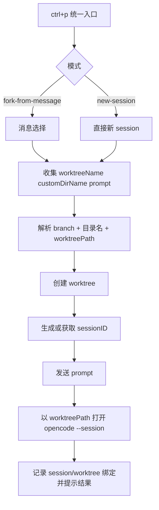

# 技术设计文档

## 概述

- **目标：** 在 `ctrl+p` 内提供“一键隔离 worktree 会话”入口。用户输入工作树名称、可选目录名与 prompt，即可完成模式选择、worktree 创建、分支初始化、新 session 启动、prompt 注入。
- **上下文：** 当前仓库已分别具备 TUI 命令入口、worktree 创建、session fork、prompt 发送、终端拉起能力，但还缺一个面向 `ctrl+p` 的统一编排层。
- **适用范围：**
  - TUI `ctrl+p` 命令面板
  - 当前仓库内 worktree/session/terminal 组合链路
  - 两种启动模式：`fork-from-message`、`new-session`
- **非目标：** 不做完整 worktree 管理台；不替换现有 `/btw`、`/worktree-create`、已有“新 tmux 窗口”命令；不在本期加入独立的“自定义分支名”字段。

## 设计结论

1. `ctrl+p` 新增单一入口，内部先选模式，再收集工作树名称、可选目录名与 prompt，最后走统一编排服务；不把两种模式拆成两条分散命令。
2. worktree 目录不再放 `~/.local/share/opencode/worktree/...`；改为放在 git 根目录父目录下，与当前仓库同级。
3. 默认目录名由“git 根目录文件夹名 + 工作树名称”规范化拼接生成；若用户提供自定义目录名，则以用户输入覆盖默认值。
4. branch 名不再从 prompt 派生，而是从用户输入的工作树名称规范化生成，并继续复用现有 branch 校验与冲突处理。
5. `fork-from-message` 模式先 fork 指定消息生成新 session；`new-session` 模式先用 SDK `session.create` 预创建新 session；两条路径之后统一走 prompt 注入与终端拉起。
6. agent 感知新工作区，靠 `openSessionTerminal(worktreePath, sessionID)` 保证新进程 cwd 就是新 worktree；不依赖额外提示词“告诉” agent。
7. 部分成功默认保留资源，不自动回滚 worktree 或 session；返回明确恢复信息，避免隐藏状态。
8. 本次实现只落当前仓库；不新增外部服务，不改多仓边界。

## 仓库归属与实施边界

- **归属决策：** 本次实现全部落当前仓库。
  - **责任边界：** 新增 `ctrl+p` 交互、统一编排层、直接新 session 预创建链路、失败结果汇总；不改 OpenCode SDK 本身。
  - **位置证据：** `src/tui.tsx`、`src/plugin/worktree.ts`、`src/plugin/worktree/fork-session.ts`、`src/plugin/worktree/terminal.ts`
  - **归属原因：** 现有 TUI 命令、worktree 生命周期、session fork 与 terminal 打开逻辑都已在本仓，最小改动应继续落这里。
- **归属决策：** `@opencode-ai/sdk` 仅复用，不在本次范围。
  - **责任边界：** 只消费已有 `session.create`、`session.fork`、`session.prompt` 能力；不扩 SDK 协议。
  - **位置证据：** `node_modules/@opencode-ai/sdk/dist/v2/gen/sdk.gen.js:921-947,1110-1136,1275-1308`
  - **归属原因：** 需求是编排现有能力，不是新增底层接口。

## 架构

方案分四层：

1. **TUI 交互层**：在 `src/tui.tsx` 注册新命令，负责模式选择、消息选择、prompt 输入、触发执行。
2. **命名与路径解析层**：把用户输入的工作树名称解析为 branch 名、默认目录名与最终 worktreePath。
3. **统一编排层**：新增 worktree-session launch helper，负责把“建 worktree / 建 session / 发 prompt / 打开终端 / 记录状态”串成单条事务式流程。
4. **底层复用层**：继续复用 `createWorktree`、`forkWithContext`/fork helper、`openSessionTerminal`、state 持久化与 branch 校验。

关键流程：先解析 `repoRootName + worktreeName + customDirectoryName?`，得到 branch 与 worktreePath；再创建 worktree；之后分流处理 session 来源；成功后统一发 prompt，最后用新 worktree 作为 cwd 打开 session。这样 session 上下文与工作区上下文同时隔离。



## 服务端接口契约

本方案不涉及服务端接口。

## 组件和接口

### 组件 1：TUI worktree-session 入口

- **建设方式:** 扩展
- **职责:** 在 `ctrl+p` 内提供统一入口，收集模式、消息来源、工作树名称、可选目录名与 prompt。
- **输入 / 输出:** 输入为当前 route、当前 session 消息列表、用户输入；输出为标准化 launch input。
- **协作关系:** 向统一编排层提交参数；仅负责交互，不负责建 worktree 或建 session。
- **复用来源 / 扩展点:** 基于现有 `src/tui.tsx` 命令注册与 `DialogSelect` 流程扩展；复用当前 `currentSessionID`、`getForkableMessageOptions` 思路。
- **关键规则:**
  - `fork-from-message` 仅在当前 route 为 session 且存在可 fork 用户消息时可用。
  - `new-session` 模式不依赖当前 session，可直接从当前目录启动。

### 组件 2：命名与路径解析器

- **建设方式:** 新增
- **职责:** 把用户输入的工作树名称解析为合法 branch 名、默认目录名与最终 worktreePath。
- **输入 / 输出:** 输入为 `repoRoot`、`worktreeName`、`customDirectoryName?`；输出为 `branch`、`directoryName`、`worktreePath`。
- **协作关系:** 先于统一编排层执行；其结果供 worktree 创建与状态持久化使用。
- **复用来源 / 扩展点:** 复用现有 branch 校验 schema；新增 sibling-path 解析逻辑，替代当前 `getWorktreePath` 的 home 目录策略。
- **关键规则:**
  - 默认目录名按“git 根目录文件夹名 + 工作树名称”规范化拼接生成。
  - 若用户提供自定义目录名，则只覆盖目录名，不覆盖 branch 名来源。
  - `worktreePath = dirname(repoRoot) + directoryName`，保证与当前仓库同级。

### 组件 3：worktree-session 统一编排服务

- **建设方式:** 新增
- **职责:** 串联 worktree 创建、session 来源解析、prompt 注入、terminal 拉起、状态持久化与结果汇总。
- **输入 / 输出:** 输入为 `directory + mode + worktreeName + customDirectoryName? + prompt + sourceMessageId?`；输出为 `sessionId + worktreePath + branch + warning/error`。
- **协作关系:** 调用 branch 生成器、worktree 创建能力、session 初始化/ fork 能力、terminal 适配器、state 持久化。
- **复用来源 / 扩展点:** 复用 `src/plugin/worktree.ts` 中 `createWorktree`、`addSession`、config sync/hook 链路；把当前分散在 `executeBtw` / `executeWorktreeCreate` 的编排抽到可复用 helper。
- **关键规则:**
  - 先解析路径与 branch，再建 worktree，再建/取 session，保证 session 从一开始就绑定目标工作区语义。
  - prompt 发送失败不回滚已创建资源，但结果对象必须带 warning 与手动恢复命令。

### 组件 4：session 来源解析器

- **建设方式:** 扩展
- **职责:** 根据模式生成目标 sessionID。
- **输入 / 输出:** 输入为 `mode`、当前 `sessionId`、`sourceMessageId?`、`worktreePath`；输出为新 `sessionId`。
- **协作关系:** `fork-from-message` 走 fork helper；`new-session` 走 SDK `session.create`。
- **复用来源 / 扩展点:** 复用 `src/plugin/worktree/fork-session.ts` 中支持 `messageId` 的 fork 能力；补一条 direct-create 分支，避免继续依赖“先打开空 opencode 再等待未知 session id”。
- **关键规则:**
  - `fork-from-message` 必须把 `messageId` 显式传入 fork 请求，不再丢失来源消息语义。
  - `new-session` 必须先通过 `session.create` 得到稳定 `sessionId`，再允许自动发 prompt。

### 组件 5：terminal 启动适配器

- **建设方式:** 复用
- **职责:** 用新 worktree 作为 cwd 打开 `opencode --session <id>`。
- **输入 / 输出:** 输入为 `worktreePath`、`sessionId`、`windowName`；输出为成功或失败结果。
- **协作关系:** 接收统一编排层调用；失败时只影响“自动打开窗口”，不影响已创建资源本身。
- **复用来源 / 扩展点:** 复用 `src/plugin/worktree/terminal.ts` 中 `openSessionTerminal` 与底层 `openTerminal/openTmuxWindow`。
- **关键规则:**
  - cwd 必须传 `worktreePath`，这是 agent 感知新工作区核心条件。
  - 终端打开失败时，必须返回可手动执行 `opencode --session <id>` 的恢复提示。

## 代码复用分析

本方案核心不是重写 worktree 系统。核心是把现有分散能力收敛成单个可复用编排入口，并把 worktree 路径策略从 home 目录切到 repo 同级目录，同时补齐“direct new session 可预创建并自动发 prompt”能力。

### 复用主轴

- **已有 worktree 生命周期继续做底座**：branch 校验、copy/symlink/hook、state 持久化都继续复用，只替换路径解析策略，避免再造一套 worktree 基础设施（位置：`src/plugin/worktree.ts`、`src/plugin/worktree/state.ts`）。
- **已有 session/terminal 能力继续做出口**：fork、prompt、terminal 打开都已有成熟实现，本次只补统一入口与 direct-create 分支，新增代码集中在编排层（位置：`src/plugin/worktree/fork-session.ts`、`src/plugin/worktree/terminal.ts`、`src/tui.tsx`）。

### 高风险复用点

- **fork 逻辑当前有两份实现**：`worktree.ts` 内部 `forkWithContext` 与 `fork-session.ts` 外部 helper 能力接近但参数不完全一致，尤其 `messageId` 支持不一致；若继续双轨演进，容易出现“ctrl+p 选了消息但底层没带上 messageId”问题（位置：`src/plugin/worktree.ts:222-318`、`src/plugin/worktree/fork-session.ts:47-115`）。
- **路径策略从共享目录切到 repo 同级目录**：当前 `getWorktreePath` 以 `~/.local/share/opencode/worktree/<project-id>/<branch>` 为核心；改成 repo 同级目录后，state 里存储的 path、create/remove 入口、用户提示文案都要一起对齐，避免删错目录或展示旧路径（位置：`src/plugin/worktree/state.ts:77-83`、`README.md:39-46`）。
- **terminal 成功不等于 session 完整可用**：窗口拉起与 session 是否已收到 prompt 是两个阶段，结果汇总必须区分“session 成功但 terminal 失败”与“prompt 失败但 session 成功”（位置：`src/plugin/worktree/terminal.ts:1026-1036`、`src/plugin/worktree.ts:751-778,834-849`）。

### 明确不复用项

- **不复用现有 `/worktree-create` 文本命令解析做主入口**：slash command 适合扁平参数，不适合 mode/message/prompt 多步交互；本次主入口放 `ctrl+p`，底层编排再复用（位置：`src/plugin/worktree/command-routing.ts`）。
- **不复用现有“直接打开空新 session”命令作为主链路**：当前 `openTerminal(cwd, "opencode")` 没有稳定 sessionID，无法先发 prompt；本次改为先创建 session，再打开终端（位置：`src/tui.tsx:116-137`）。
- **不复用现有 home 目录 worktree 存放策略**：新需求要求 repo 同级目录，继续使用共享目录会直接违背用户期望；因此必须替换，不做兼容保留（位置：`src/plugin/worktree/state.ts:77-83`、`README.md:39-46`）。

### 集成关系

- **TUI 命令面板 ↔ worktree 编排服务**：命令面板只负责收集输入，编排服务负责执行副作用，保持交互层薄、执行层集中（位置：`src/tui.tsx`、新 launch helper）。
- **编排服务 ↔ worktree state**：成功创建后写入 session/worktree 绑定，保证后续 delete/cleanup 仍沿用现有机制（位置：`src/plugin/worktree/state.ts`）。
- **命名与路径解析 ↔ worktree create/remove**：解析器统一给出 branch 与 sibling-path，避免 TUI、plugin、cleanup 各自拼路径（位置：`src/plugin/worktree.ts`、`src/plugin/worktree/state.ts`）。
- **编排服务 ↔ SDK session API**：通过 `session.create / session.fork / session.prompt` 建立 direct/fork 两种来源统一模型（位置：`node_modules/@opencode-ai/sdk/dist/v2/gen/sdk.gen.js:921-947,1115-1136,1279-1308`）。

## 数据模型

### 模型 1：`WorktreeSessionLaunchMode`（type；协议负载 / 交互分支）

- **使用场景:** `ctrl+p` 入口把用户选择传给编排层时使用。
- **写入方:** TUI 交互层。
- **消费方:** 统一编排服务、session 来源解析器。
- **生命周期:** 单次启动请求内临时存在。

```ts
type WorktreeSessionLaunchMode = "fork-from-message" | "new-session"
```

### 模型 2：`WorktreeSessionLaunchInput`（interface；协议负载 / 启动请求）

- **使用场景:** 统一编排服务入口参数。
- **写入方:** TUI 交互层在用户完成输入后组装。
- **消费方:** worktree-session 统一编排服务。
- **生命周期:** 单次启动请求负载。

```ts
interface WorktreeSessionLaunchInput {
  // 当前仓库目录。用于生成 projectId、worktreePath、session workspace 语义。
  directory: string

  // 启动模式。决定 session 来源分支。
  mode: WorktreeSessionLaunchMode

  // 用户输入的工作树名称。用于生成 branch 与默认目录名。
  worktreeName: string

  // 可选自定义目录名。若提供，则覆盖默认目录名。
  customDirectoryName?: string

  // 用户输入 prompt。作为首条消息发送给新 session。
  prompt: string

  // 当前 session id。fork-from-message 必填；new-session 可为空。
  currentSessionId?: string

  // fork 来源消息 id。仅 fork-from-message 使用。
  sourceMessageId?: string
}
```

### 模型 3：`ResolvedWorktreeTarget`（interface；状态结构 / 路径解析结果）

- **使用场景:** 在真正创建 worktree 前冻结目录名、branch 与 worktreePath。
- **写入方:** 命名与路径解析器。
- **消费方:** 统一编排服务、state 写入逻辑、结果提示。
- **生命周期:** 单次启动请求内临时存在。

```ts
interface ResolvedWorktreeTarget {
  // 规范化后的 branch 名。来自 worktreeName，不来自 prompt。
  branch: string

  // 最终使用的目录名。可能是默认拼接结果，也可能是用户自定义值。
  directoryName: string

  // 最终 worktree 绝对路径。位于 git 根目录父目录下。
  worktreePath: string
}
```

### 模型 4：`WorktreeSessionLaunchResult`（interface；状态结构 / 启动结果）

- **使用场景:** 编排层向 TUI 返回成功、部分成功、失败结果时使用。
- **写入方:** 统一编排服务。
- **消费方:** TUI toast/结果提示、后续 state 写入逻辑。
- **生命周期:** 单次启动结束时生成，随后可丢弃。

```ts
interface WorktreeSessionLaunchResult {
  // 是否完成最小闭环：worktree 与 session 已创建。
  ok: boolean

  // 创建出的 worktree 路径。失败前若未生成则为空。
  worktreePath?: string

  // 新 session id。用于手动恢复或继续打开。
  sessionId?: string

  // 自动生成 branch 名。用于诊断与后续 cleanup。
  branch?: string

  // 最终目录名。用于向用户解释创建位置。
  directoryName?: string

  // 面向用户主消息。必须能独立说明当前状态。
  message: string

  // 部分成功时附带 warning，不覆盖主状态。
  warning?: string
}
```

## 错误处理

### 错误场景

1. **场景 1:** 当前不在 session 页面，却选择 `fork-from-message`。

- **处理方式:** 在 TUI 侧直接禁用或拦截，不进入编排层。
- **用户影响:** 用户看到“当前不在 session 页面”或“没有可 fork 消息”，不会产生脏资源。

2. **场景 2:** worktree 名称经规范化后 branch 不合法，或 worktree 创建失败。

- **处理方式:** 调用现有 branch 校验；若失败，直接结束并返回失败原因；不创建 session。
- **用户影响:** 用户看到明确失败步骤；当前工作区无副作用。

3. **场景 3:** 默认目录名或自定义目录名不合法，或目标目录已存在。

- **处理方式:** 在创建前完成目录名校验与冲突检查；失败时直接结束，不进入 git worktree add。
- **用户影响:** 用户看到具体目录问题，并可修改输入后重试。

4. **场景 4:** fork/create 失败。

- **处理方式:** 保留已创建 worktree，但不写 session 绑定；结果中明确提示“worktree 已创建，session 未创建”。
- **用户影响:** 用户可选择手动删除 worktree 或后续复用，不会误以为 session 已可用。

5. **场景 5:** prompt 发送失败。

- **处理方式:** 保留 worktree 与 session，继续尝试打开终端；结果附带 warning 与手动补发提示。
- **用户影响:** 用户能进入新 session，但需手动重新发送 prompt。

6. **场景 6:** terminal 打开失败。

- **处理方式:** 保留已创建 worktree 与 session，返回 `opencode --session <id>` 手动恢复命令。
- **用户影响:** 自动跳转失败，但资源未丢；用户仍可手动进入。

## 测试策略

### 单元测试

- 测试 worktree name → branch / 默认目录名解析：中文、空白、超长、重复名称、非法字符场景。
- 测试 launch input 校验：两种 mode 各自必填字段约束，以及 `customDirectoryName` 覆盖默认目录名行为。
- 测试 result 汇总：worktree 失败、session 失败、prompt warning、terminal 失败四类结果文案。

### 集成测试

- mock `createWorktree + session.create/fork + session.prompt + openSessionTerminal`，验证两种模式都走统一编排出口。
- 验证 `fork-from-message` 时 `messageId` 真正传入 fork 请求。
- 验证 direct new session 时先 create 再 prompt 再 open terminal，且 cwd 为 `worktreePath`。
- 验证未输入自定义目录名时，`worktreePath` 位于 `dirname(repoRoot)` 下；输入自定义目录名时，目录名被正确覆盖。

### 端到端测试

- 在 TUI 中从 `ctrl+p` 触发 `new-session` 模式，输入工作树名称与 prompt，确认新目录与当前仓库同级，且新窗口/新 session 落在新 worktree。
- 在 TUI 中从 `ctrl+p` 触发 `fork-from-message` 模式，选消息、输入工作树名称与 prompt，确认 fork 上下文保留且 cwd 正确。
- 在 TUI 中验证自定义目录名覆盖默认目录名，且不影响 branch 生成规则。
- 人工验证 terminal 失败时提示是否带手动恢复命令。

## 遵循指导文档

- `docs/blossom/2026-04-12-ctrl-p-worktree-session/requirements.md`：约束本方案必须支持两种模式、默认保留部分成功资源、保证新 session cwd 位于新 worktree。
- `/Users/blossom/.config/opencode/AGENTS.md`：约束本方案最小改动、优先复用现有模式、不新增重型中间层与外部依赖。
